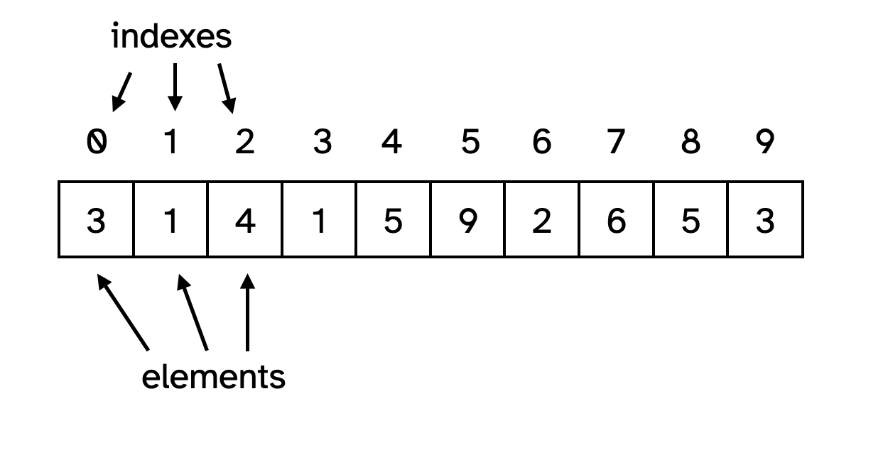

# Introducing arrays {
    
Inspiring words

## In this module

- What is an array?
- Creating an array
- Accessing the elements
- Setting the elements
- Using variables
- `.length`

## What is an array?

An array is a sequence of numbered "boxes" you can store values in. The boxes are *numbered* starting from `0`. 

The "boxes" are called *elements*.

The numbers are called *indexes*.

You could imagine an array storing 10 digits as looking something like this:



So, the element at *index* `0` is `3` and the element at index `5` is `9`. We can "get" any element in the array just by knowing its index.

The array is also *in order* because it's indexed from `0`. We don't *have* to care about the order in an array, but it's handy that we can. The values in this array are the first 10 digits of *pi* for instance.
    
## Creating an array

To create the above array in JavaScript we can declare a variable and then the array as follows:

```javascript
let piArray = [3, 1, 4, 1, 5, 9, 2, 6, 5, 3];
```
    
As you can see, when we create an array we have:

- *Square brackets*, `[ ... ]`. These are what tell JavaScript we want an array.
- A *list of values* separated by commas inside, `3, 1, 4, 1, 5, 9, 2, 6, 5, 3`. These are the elements we want in the array *in order*.

We could also create an *empty* array in the way you might expect:

```javascript
let emptyArray = [];
```

## Accessing the elements

To access a specific element in the array (either to get its value or to set its value) we use the element's *index* along with "bracket notation".

So to get the first digit from our `piArray` we would write:

```javascript
let firstDigitOfPi = piArray[0]; // 3
```

As you can see we write:

- The variable containing the array, `piArray`
- and square brackets, `[0]`, containing the index we want to access

## Setting the elements

We can use the exact same approach to *change* an element in an array. If we wanted to *break pi* for some reason, perhaps to mess with a geometrist, we could write:

```javascript
piArray[5] = 8; // Change element 5 from 9 to 8
```

Ahahaha, take that, geometry!

As you can see here, we're able to treat each *element* in an array like an individual *variable* - we can get its value or set it - by just writing the array name and then the index in square brackets.

## Using variables

This may be obvious, but you can also use *variables* as indexes or to set elements.

A variable as an index (this will be really useful later!):

```javascript
let index = 7;
let eighthDigitOfPi = piArray[index]; // 6
```

A variable as an element:

```javascript
let apple = 2;
let banana = 6;
let carrot = 4;
let nutritionalArray = [apple, banana, carrot]; // [2, 6, 4]
```

## `.length`

One last useful piece of information: arrays know *how long they are*, that is, how many elements they have. We can get that information with a property arrays have called `length`:

```javascript
let piArray = [3, 1, 4, 1, 5, 9, 2, 6, 5, 3];
let numberOfDigitsOfPi = piArray.length; // 10

let apple = 2;
let banana = 6;
let carrot = 4;
let nutritionalArray = [apple, banana, carrot];
let numberOfHealthySnacks = nutritionalArray.length; // 3
```

This will come in handy a bunch and using `length` is *much much better* than using a hardcoded number because, as we'll see, arrays can *change* over time.

## Summary

That is how arrays fundamentally work! You declare them either with or without a list of values. And then you access or change those values by using the appropriate *index*. And you know how long an array is by using `length`.

## }