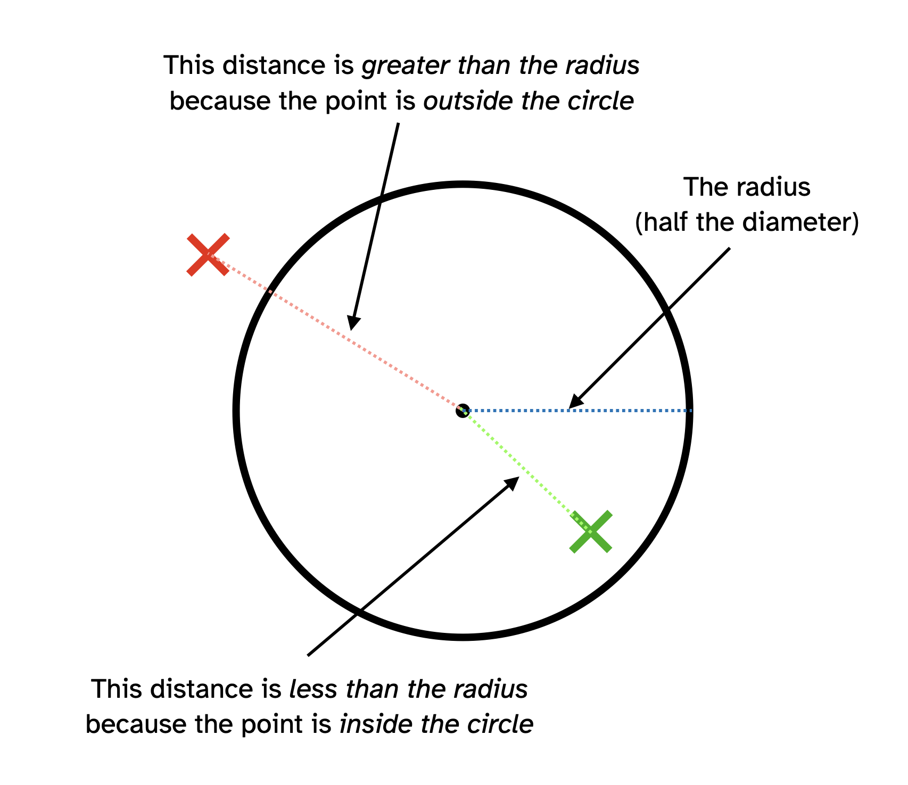

# Conditionals in practice {

## In practice: Bullseye!

### A starting point

Let's put together a program that actually does this stuff to see it working in practice. Here's a starting point, a program that draws a target on the canvas.

```javascript
// Our target
const target = {
  // Position
  x: 200,
  y: 200,
  // Size (diameter)
  size: 100,
  // Fill
  fill: "#000000",
};

/**
 * Create the canvas
 */
function setup() {
  createCanvas(400, 400);
}

/**
 * Draw the target
 */
function draw() {
  background(220);
  
  drawTarget();
}

/**
 * Draws the target as circle
 */
function drawTarget() {
  // Draw the target as a circle with appropriate fill
  push();
  noStroke();
  fill(target.fill);
  ellipse(target.x, target.y, target.size);
  pop();
}
```

Well, we can indeed see a target now, but it doesn't respond to anything. It's just a black circle after all.

### Overlapping the target

A starting idea would be to make the target change colour when we put the mouse cursor inside it! How would we do such an incredible thing? 

With an `if`-statement? Yup! And what would it look like? Something like

```javascript
if (the cursor is inside the target) {
  // Change the colour of the target to show it was hit
}
```

To check if a pair of (x,y) coordinates are inside a circle we can rely on a neat trick:

*The coordinates (x,y) are *inside* a specific circle if their *distance* from the centre of the circle* is *less than its radius*. As in this wonderful diagram!



And wonderfully there is a *function* in p5 called `dist()` that we can use to get the distance between two (x,y) coordinates! With that we can actually express our condition in math!

```javascript
function checkTarget() {
  // Get the distance from the mouse to the centre of the target (in pixels)
  let distance = dist(mouseX, mouseY, target.x, target.y);
  // Check if the distance is less than the target's radius (half its diameter/size)
  if (distance < target.size/2) {
    // Change the colour of the target to show it was hit!
    target.fill = target.fills.hit;
  }
}
```

Let's fold that into our full code, adding a property to our target object that contains the different fills it can have:

```javascript
// Our target
const target = {
  // Position
  x: 200,
  y: 200,
  // Size (diameter)
  size: 100,
  // Fill
  fill: "#000000",
  // NEW! Possible fills so we can change colours nicely
  fills: {
    // The default colour of the target
    default: "#000000",
    // The hit colour of the target
    hit: "#ffcc00"
  }
};

/**
 * Create the canvas
 */
function setup() {
  createCanvas(400, 400);
}

/**
 * Check and draw the target
 */
function draw() {
  background(220);
  
  checkTarget();
  drawTarget();
}

/**
 * Checks if the target was hit and changes its fill if so
 */
function checkTarget() {
  // Get the distance between the mouse and the centre of the target
  let distance = dist(mouseX, mouseY, target.x, target.y);
  // Check if it is less than the radius of the target
  if (distance < target.size / 2) {
    // If it is, then the mouse is *inside* the target
    // So change the fill of the target so that when we draw it
    // it will be the hit colour
    target.fill = target.fills.hit;
  }
}

/**
 * Draws the target as circle
 */
function drawTarget() {
  // Draw the target as a circle with appropriate fill
  push();
  noStroke();
  fill(target.fill);
  ellipse(target.x, target.y, target.size);
  pop();
}
```

Now if our cursor goes into the circle it changes to our `hit` colour property! The program is *paying attention* to what happens, it's no longer always the same. It is *interactive* in quite a special way.

### Not overlapping the target

An issue with the program as it stands is that if we move our cursor back out of the target it stays "hit." It would be nice if it went back to its default colour.

How do we handle the "other" situation based on a conditional? With `else`. So our conditional becomes:

```javascript
function checkTarget() {
  // Get the distance from the mouse to the centre of the target (in pixels)
  let distance = dist(mouseX, mouseY, target.x, target.y);
  // Check if the distance is less than the target's radius (half its diameter/size)
  if (distance < target.size/2) {
    // Change the colour of the target to show it was hit!
    target.fill = target.fills.hit;
  }
  else {
    // The mouse was not inside the target so set the colour to show it
    // wasn't hit!
    target.fill = target.fills.default;
  }
}
```


Now our program only changes the colour of our target if the mouse is inside it, otherwise it goes back to its default colour! Yessss!

## Bullseye!

It would be cool if there were an *inner* circle of target that would change it to a different (even better) colour - a bullseye. But to do that we need to decide between *three things*. Is the cursor:

- Inside the bullseye?
- Inside the rest of the target?
- Not in the target at all

And for that we need the `else if` part of conditionals, something like this:

```javascript
function checkTarget() {
  // Get the distance from the mouse to the centre of the target (in pixels)
  let distance = dist(mouseX, mouseY, target.x, target.y);
  // Check if the distance is less than the bullseye's radius (half its
  // diameter)
  if (distance < target.bullseyeSize/2) {
    // Change the colour of the target to show it's a bullseye!
    target.fill = target.fills.bullseye;
  }
  // If it's not in the bullseye, check if the distance is less than the target's radius (half its diameter/size)
  else if (distance < target.size/2) {
    // Change the colour of the target to show it was hit!
    target.fill = target.fills.hit;
  }
  else {
    // The mouse was not inside the target so set the colour to show it
    // wasn't hit!
    target.fill = target.fills.default;
  }
}
```

Notice that we check the bullseye *first* because it's the *most restrictive* condition.

Putting it all together (including adding the fill for a bullseye to our target object and drawing the bullseye area) we get this:

```javascript
// Our target
const target = {
  // Position
  x: 200,
  y: 200,
  // Size (diameter)
  size: 100,
  bullseyeSize: 25,
  // Fill
  fill: "#000000",
  // NEW! Possible fills so we can change colours nicely
  fills: {
    // The default colour of the target
    default: "#000000",
    // The hit colour of the target
    hit: "#ffcc00",
    // The bullseye colour of the taret
    bullseye: "#ff0000"
  }
};

/**
 * Create the canvas
 */
function setup() {
  createCanvas(400, 400);
}

/**
 * Draw the target
 */
function draw() {
  background(220);
  
  checkTarget();
  drawTarget();
}

/**
 * Checks if the target was hit (or bullseyed) and changes its fill if so
 */
function checkTarget() {
  // Get the distance from the mouse to the centre of the target (in pixels)
  let distance = dist(mouseX, mouseY, target.x, target.y);
  // Check if the distance is less than the bullseye's radius (half its
  // diameter)
  if (distance < target.bullseyeSize/2) {
    // Change the colour of the target to show it's a bullseye!
    target.fill = target.fills.bullseye;
  }
  // If it's not in the bullseye, check if the distance is less than the target's radius (half its diameter/size)
  else if (distance < target.size/2) {
    // Change the colour of the target to show it was hit!
    target.fill = target.fills.hit;
  }
  else {
    // The mouse was not inside the target so set the colour to show it
    // wasn't hit!
    target.fill = target.fills.default;
  }
}

/**
 * Draws the target as a circle
 */
function drawTarget() {
    
  // Draw the target as a circle with appropriate fill
  push();
  noStroke();
  fill(target.fill);
  ellipse(target.x, target.y, target.size);
  
  // Draw the bullseye area as a circle so we can see it
  stroke("#ffffff");
  ellipse(target.x, target.y, target.bullsEyeSize);
  pop();
}
```
    
## Summary  
  
Also, did you notice how nice it was to use functions? We just worked on the `checkTarget()` function most of the time because that's the bit where we were handling our conditions.

## }