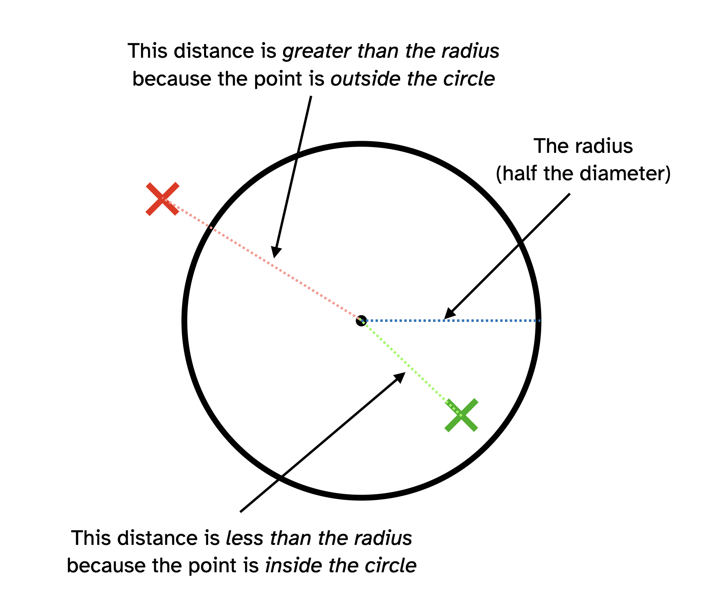

# Conditionals in practice: Part 2: Massage {

AND, OR, NOT, got it. But what could we *do* with them?

## In this module

- Our creature is back
- Massage!
    
## Our creature is back

We're going to keep working on the creature from the [Conditionals in practice: Part 1: Creatures loves mouse](./conditionals-in-practice-part-1.md) module so if you don't have that code sitting around, go back and grab it from the end of the module! I'll wait...

... okay!

Currently our creature responds in different ways to the mouse and keys, but we can be a bit more sophisticated now with logic operators. So let's delete the stuff in its `checkInput()` and change it up.

## Massage!

Let's change what makes the creature happy: massage.

How could we think of massage in the context of the mouse? What if we consider it massage if *two* things are true:

- The cursor is overlapping the creature AND
- The cursor is moving

So we want to be able to write something like:

```javascript
if (mouseIsOverlapping && mouseIsMoving) {
  // The cursor is overlapping the creature AND it's moving
  // So the creature is happy!
  creature.fill = creature.fills.happy;
}
```

These would be our two conditions. But for that to work we need the variables `mouseIsOverlapping` and `mouseIsMoving` to have the right `true` or `false` values in them.... so something like:

```javascript
const mouseIsOverlapping = ?;
const mouseIsMoving = ?;
if (mouseIsOverlapping && mouseIsMoving) {
  // The cursor is overlapping the creature AND it's moving
  // So the creature is happy!
  creature.fill = creature.fills.happy;
}
```

(We might as well use `const` here because we're not going to change these variables later.)

### `mouseIsOverlapping`

So, how do we write a condition that checks if the mouse cursor overlaps a circle (the creature)?

To check if a pair of (x,y) coordinates are inside a circle we can rely on a neat trick:

*The coordinates (x,y) are inside a specific circle if their *distance* from the centre of the circle* is *less than its radius*. As in this wonderful diagram:



Better yet, there is a *function* in p5 called `dist()` that we can use to get the distance in pixels between two (x,y) coordinates! With that we can actually express our condition in math! Like this!

```javascript
// Calculate the distance between the cursor and the creature
// and put it into a "distance" variable (using const again since
// we won't change this again later!)
const distance = dist(mouseX, mouseY, creature.x, creature.y);
// Calculate whether the mouse overlaps the creature by checking whether
// the distance is less than its radius! (Half its diameter)
const mouseIsOverlapping = (distance < creature.size/2);
```

When we do this `mouseIsOverlapping` will be `true` is the mouse is inside the creature's circle, and `false` if it isn't!

### `mouseIsMoving`

How can we tell if the mouse is moving? Fortunately p5 gives us two variables that help us out here: `movedX` and `movedY` store how many pixels the mouse moved since the last frame on the x- and y-axes respectively. So, if *either* of them are not `0` then the mouse moved right?

And that is maths, so we can write the code!

```javascript
// Check if EITHER movedX OR movedY are NOT equal to zero
// and store the result in our mouseIsMoving variable (another
// const because we don't want to change it later)
const mouseIsMoving = (movedX !== 0 || movedY !== 0);
```

That gives us both of our conditions, so we can finally check for massage

### Massage is go

We can replace our creature's `checkInput()` with our new idea!

```javascript
/**
 * Creature is happy if being massaged and otherwise bored
 */
function checkInput() {
    // Calculate the distance between the cursor and the creature
    // and put it into a "distance" variable (using const again since
    // we won't change this again later!)
    const distance = dist(mouseX, mouseY, creature.x, creature.y);
    // Calculate whether the mouse overlaps the creature by checking whether
    // the distance is less than its radius! (Half its diameter)
    const mouseIsOverlapping = (distance < creature.size/2);
    // Check if EITHER movedX OR movedY are NOT equal to zero
    // and store the result in our mouseIsMoving variable (another
    // const because we don't want to change it later)
    const mouseIsMoving = (movedX !== 0 || movedY !== 0);
    // Check if the mouse if over the creature and moving
    if (mouseIsOverlapping && mouseIsMoving) {
        // The cursor is overlapping the creature AND it's moving
        // So the creature is happy! Massage!
        creature.fill = creature.fills.happy;
    }
    else {
        // Otherwise the creature is bored
        creature.fill = creature.fills.bored;
    }
}
```

Phew! Now we have a creature that's happy if we're giving it a little mouse massage, and otherwise it's just SO BORED.

It's feeling more and more like a real thing.

## Summary

Most of the time when we're thinking about situations we care about, we care about *combinations* of events and ideas. Logic operators help us to *combine conditions* and so they allow us to express more complex (and naturalistic!) ideas about the world of our program.
    
## }

## Complete creature code

```javascript
// Our creature
const creature = {
  // Position
  x: 200,
  y: 200,
  // Size
  size: 200,
  // Fill
  fill: "#000000", // Starts out bored
  // Possible fills for the creature that show its mood
  // We'll need these when we start changing its colour
  // and its nice to keep them along with all the other info
  // about the creature
  fills: {
    bored: "#000000", // Black
    happy: "#33cc33", // Green
    angry: "#cc3333", // Red
    dead: "#777777" // Grey
  }
};

/**
 * Creates the canvas
 */
function setup() {
  createCanvas(400, 400);
}

/**
 * Fills the background, displays the creature 
 */
function draw() {
  background(255, 200, 127);
  
  checkInput();
  drawCreature();
}
/**
 * Creature is happy if being massaged and otherwise bored
 */
/**
 * Creature is happy if being massaged and otherwise bored
 */
function checkInput() {
    // Calculate the distance between the cursor and the creature
    // and put it into a "distance" variable (using const again since
    // we won't change this again later!)
    const distance = dist(mouseX, mouseY, creature.x, creature.y);
    // Calculate whether the mouse overlaps the creature by checking whether
    // the distance is less than its radius! (Half its diameter)
    const mouseIsOverlapping = (distance < creature.size/2);
    // Check if EITHER movedX OR movedY are NOT equal to zero
    // and store the result in our mouseIsMoving variable (another
    // const because we don't want to change it later)
    const mouseIsMoving = (movedX !== 0 || movedY !== 0);
    // Check if the mouse if over the creature and moving
    if (mouseIsOverlapping && mouseIsMoving) {
        // The cursor is overlapping the creature AND it's moving
        // So the creature is happy! Massage!
        creature.fill = creature.fills.happy;
    }
    else {
        // Otherwise the creature is bored
        creature.fill = creature.fills.bored;
    }
}

/**
 * Handles the creature becoming happy
 */
function creatureHappy() {
    creature.fill = creature.fills.happy;
}

/**
 * Handles the creature becoming bored
 */
function creatureBored() {
    creature.fill = creature.fills.bored;
    // Increase its boredom level by one
    creature.boredomLevel += 1;
    // Check if the creature has died of boredom
    if (creature.boredomLevel > creature.deathByBoredomThresshold) {
        // Creature dies of boredom!
        creature.alive = false;
        // Creature turns dead coloured!
        creature.fill = creature.fills.dead;
    }
}

/**
 * Draws the creature
 */
function drawCreature() {
  push();
  noStroke();
  // Use the creature's fill
  fill(creature.fill);
  // Display the creature at its position and size
  ellipse(creature.x, creature.y, creature.size);
  pop();
}
```