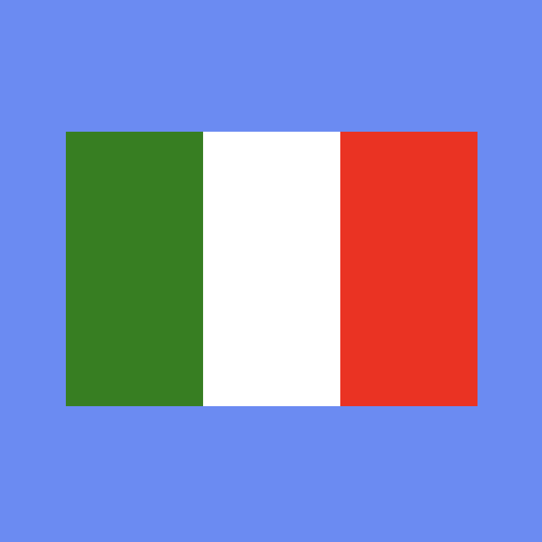
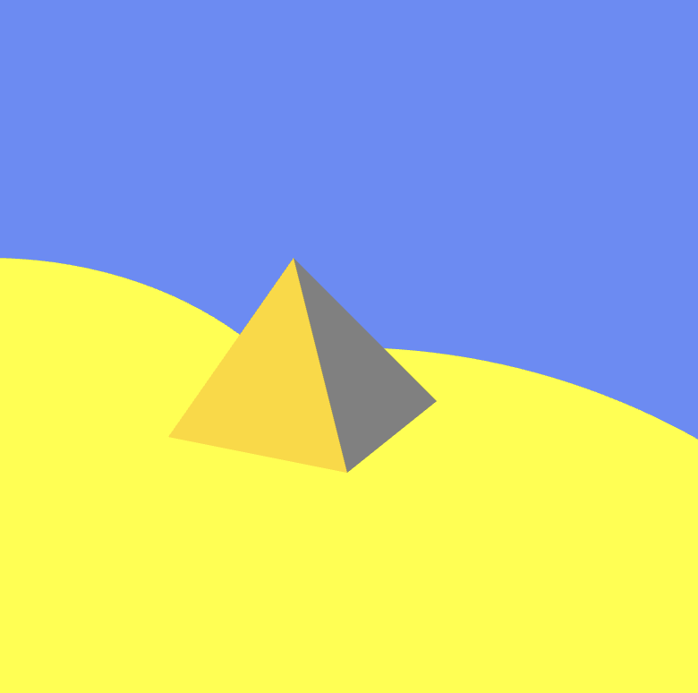
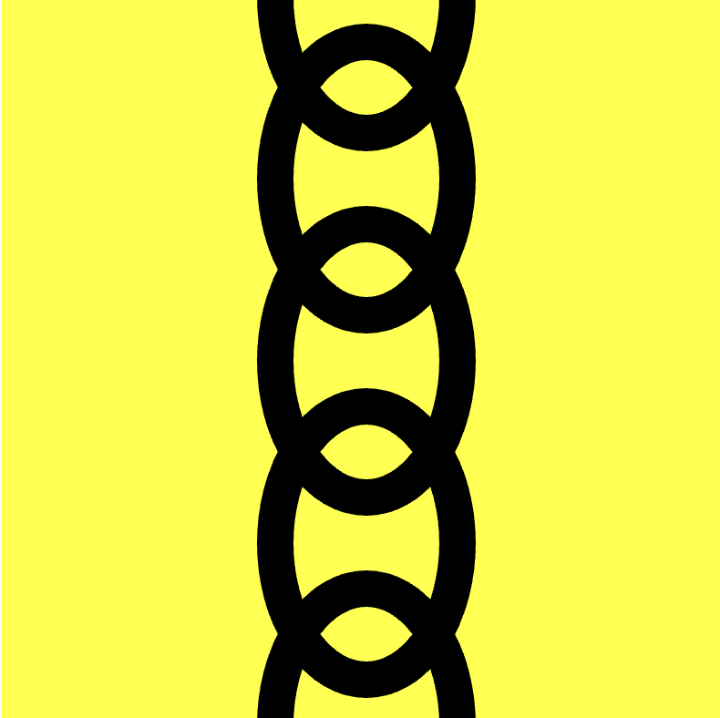
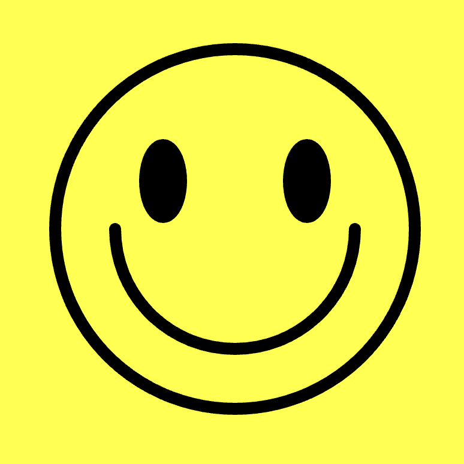
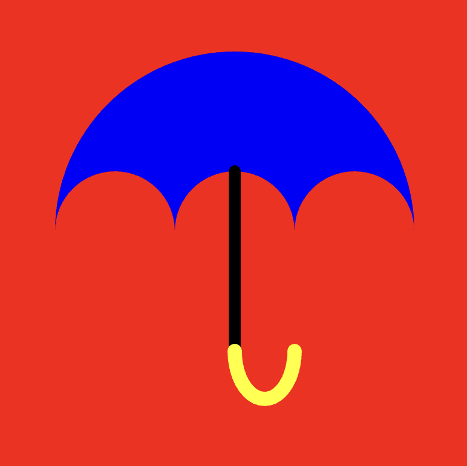

# Drawing challenges {
    
At this point you've seen a lot! You know how to draw shapes, colour them, break your program down into functions, comment it, read the documentation, and debug your code.

In order to make sure you really know this stuff, it's important to play around with code. Here are some small challenges for you to try out. 

## Try to draw:

### 1. The Italian flag against a blue background

Rectangles should do?

### 2. A pyramid with sand dunes in the background

Two triangles for the pyramid?

### 3. A black chain hanging vertically down the center of the canvas against a yellow background.

Ellipses with a thick stroke?

### 4. A classic Smiley Face.

Arcs might be your friend here?

### 5. An umbrella.

This might need a shape made of arcs?

## Debug this:

Here's a broken version of one of the examples. See if you can debug it!

[Download the Instructions Debugging Challenge Project](./instructions-debugging-challenge.zip)

## }