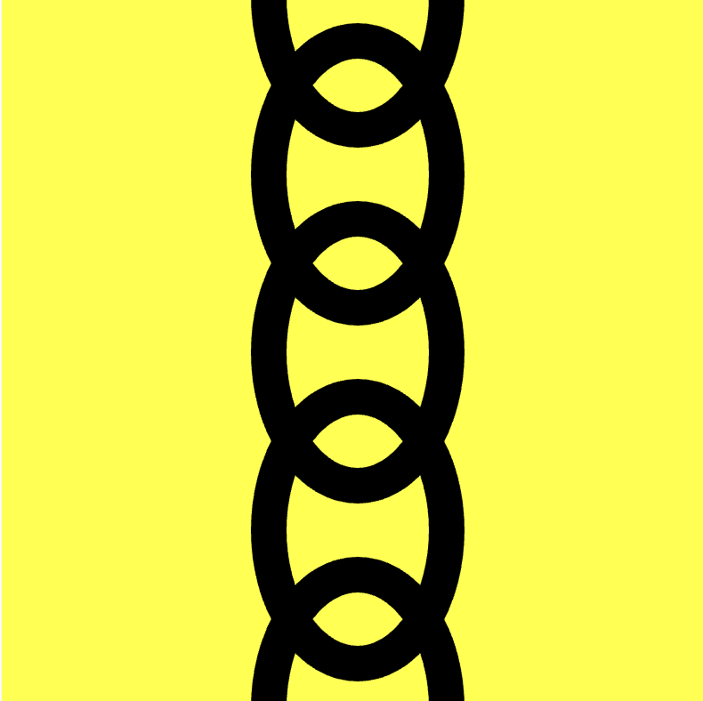
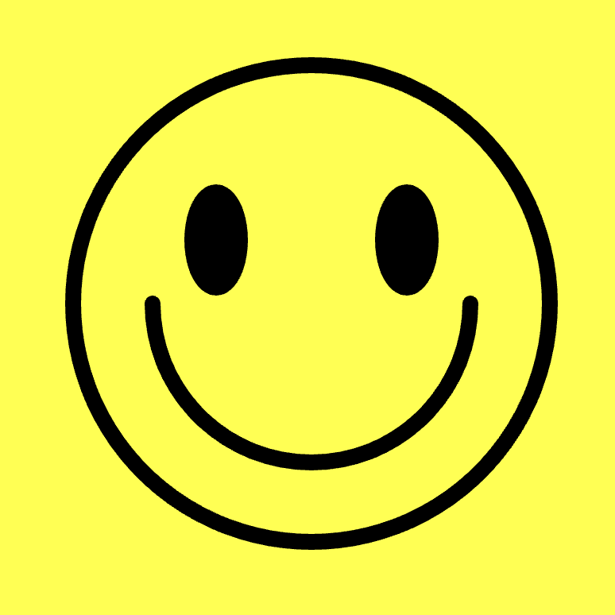

# Five drawing challenges {
    
At this point you've seen a lot! You know how to draw shapes, colour them, break your program down into functions, comment it, read the documentation, and debug your code.

In order to make sure you really know this stuff, it's important to play around with code. Here are some small challenges for you to try out. Try to draw some or all of the following things (not all on the same canvas!).

(All images are just examples produced with code - you should feel free to experiment!)

*The Italian flag against a blue background.* (rectangles should do?)

*A pyramid with sand dunes in the background.* (two triangles for the pyramid?)

*A black chain hanging vertically down the center of the canvas against a yellow background.* (elipses with a thick stroke?)

*A classic Smiley Face.* (arcs might be your friend here?)

*An umbrella.* (this might need a shape made of arcs?)

## }