# Function calls {

## Introduction

We're going to look at the most fundamental kind of JavaScript instruction, the *function call*. A function is a way to tell our program to do something more complicated by just using a *name* and some *information*.

## Preparation

1. Download the [template project](XXXX)
2. Unzip it
3. Open the resulting folder in VS Code
4. Give the project a title in `index.html`

## `setup()` and `draw()`

In `script.js` we see two functions by default: `setup()` and `draw()`. These are function *definitions* and we will learn about how useful this is shortly. For now, we need to know that if we write code *inside the curly brackets* of these functions, that code will "run" (or "happen", or "execute") when our program runs.

Code we put in `setup()`'s curly brackets will happen once at the start of our program.

Code we put in `draw()`'s curly brackets will happen every *frame* our program is running.

## Create a canvas

For our first *function call* we will create the *canvas* we need to be able to display cool stuff on. So let's modify `setup()` to do this:

```javascript
function setup() {
 createCanvas(640, 480);
}
```

That new line is a *function call* that tells our program to, you guessed it, *create a canvas* on our webpage. A "canvas" is a part of HTML that lets us draw things (instead of using text and images via HTML tags). `createCanvas()` is letting us create it from inside our program.

There's more going on here than just the *name* here, though, so let's break it down.

1. `createCanvas` is the *name* of the function we are calling. It's a *good name* because it describes what the function does: it *create*s a *canvas*.
2. Then we have a set of *parentheses* with stuff inside them: `(...)`. These parentheses are what tells JavaScript to *execute* the function with this name (without them it wouldn't run).
1. Some function calls have *nothing* inside the parentheses, like `setup()`, but lots of them have *extra information* needed to run the function called *arguments*.
3. For `createCanvas` we have *two arguments* that tell the function what kind of canvas to create. Specifically, they tell it the *size* of the canvas to create.
1. The *first argument* of `640` tells it the canvas should be `640` pixels wide
2. The *second argument* of *480* tells it the canvas should be `480` pixels high
3. The two arguments are separated by a *comma* so that JavaScript can see that there are two in this case
4. Other functions may have zero arguments, or one, or two, or many more
4. After we close the parentheses to say we're done providing arguments and that this function call should be *executed* we have...
5. ... a semicolon: `;`. This just means "this instruction is done!"
1. **Tip:** JavaScript does *not* always need the semicolon to be there to work, but it is a *very good idea* to include them because other programming languages you may want to learn *do require them*. May as well.

## Draw a background

If we ran our program right now it would look underwhelming because we're not *drawing* anything on the canvas. Let's fix that by adding a new *function call*, this time in `draw()`:

```javascript
function draw() {
 background(255, 100, 100);
}
```

Hopefully, you can see this has the same *structure* as the `createCanvas()` function call we added just before:

1. We have the *function name* `background` which is a function that tells p5 to fill the entire canvas with a colour of your choice
2. We have the *parentheses* that go around the *arguments* and also tell JavaScript to *execute* this instruction
3. We have the *arguments* that tell `background` extra information on what to do
4. We have the *semicolon* at the end to say "done!"

Obviously the function *name* is different, because it has a different job: filling the "background" of the canvas with a color.

But we also have a different set of *arguments*. This time there are *three* and they are different numbers from before. What do they mean?

In this case they are the red, green, and blue (RGB) values to use when filling the canvas with a colour. They determine the colour that `background` will use. Importantly, they are numbers *between `0` and `255`*. `0` is *none of that colour*. `255` is *all of that colour*. So:

1. `255` is for the *red* amount in the colour and it means "all the red!"
2. The first `100` is for the *green* amount in the colour, "a bit less than half the green"
3. And the second `100` is for the *blue* about in the colour, "the same amount of blue"

What is the resulting colour? Let's see!

1. In VS Code click on the `Go Live` button at the bottom right of your editor
2. This should open your default browser (which should be *Chrome* ideally) and display your program
3. Thus you should see a the beautiful pink background you filled the canvas with

Because our `background` function call is in `draw()` it is actually being executed *every frame*, but since it always draws the *same pink colour* we don't see anything change.

## Positions on the canvas

In order to draw things at specific positions we need to know how to refer to those positions on the canvas with numbers. Because computers love numbers. In this case we'll be talking about *coordinates*.

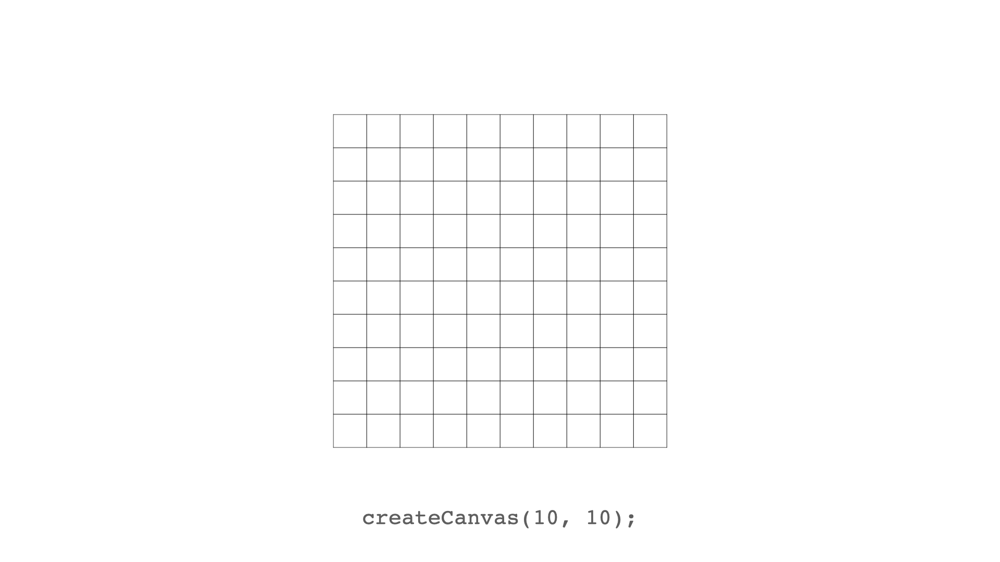

So, if we create a tiny 10x10 canvas, it looks like this.

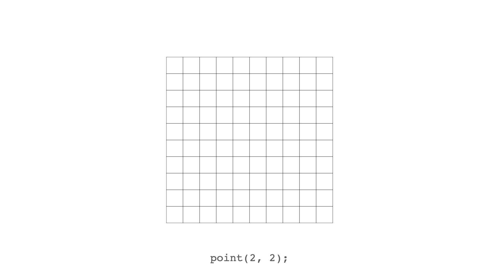

We can then draw a point (a single pixel) at the coordinates (2, 2)...

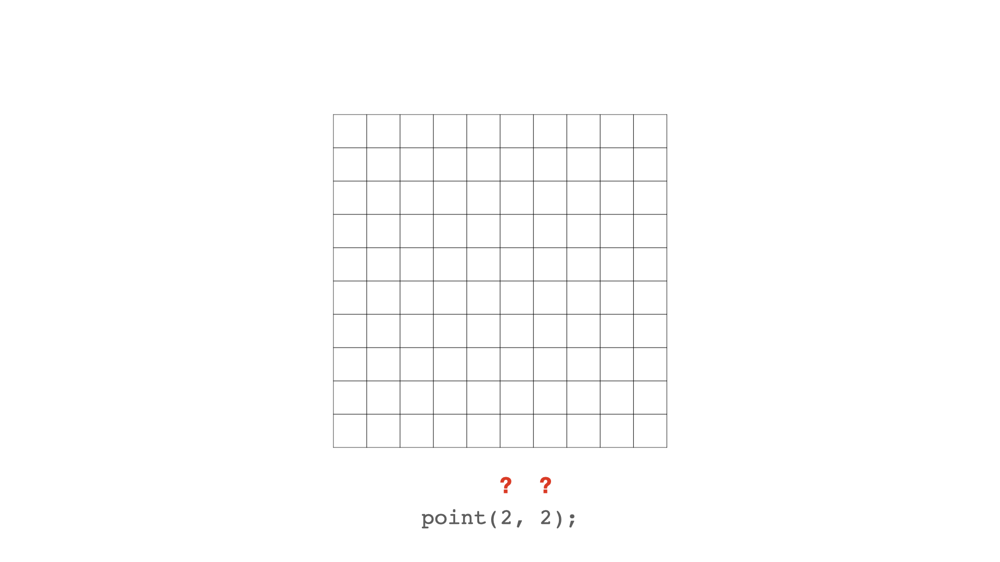

But what does (2, 2) mean?

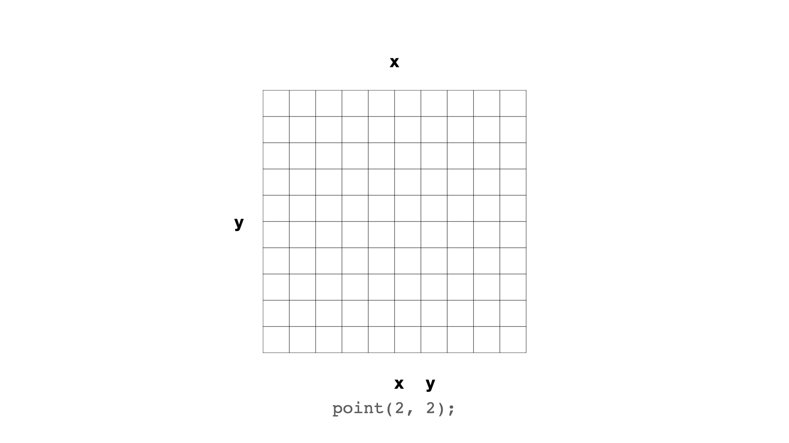

These are the *x* and *y* coordinates we want to draw our pixel at. The *x* coordinate tells us where to draw the pixel on the *horizontal* axis. And the *y* coordinate tells us where to draw the pixel on the *vertical* axis.

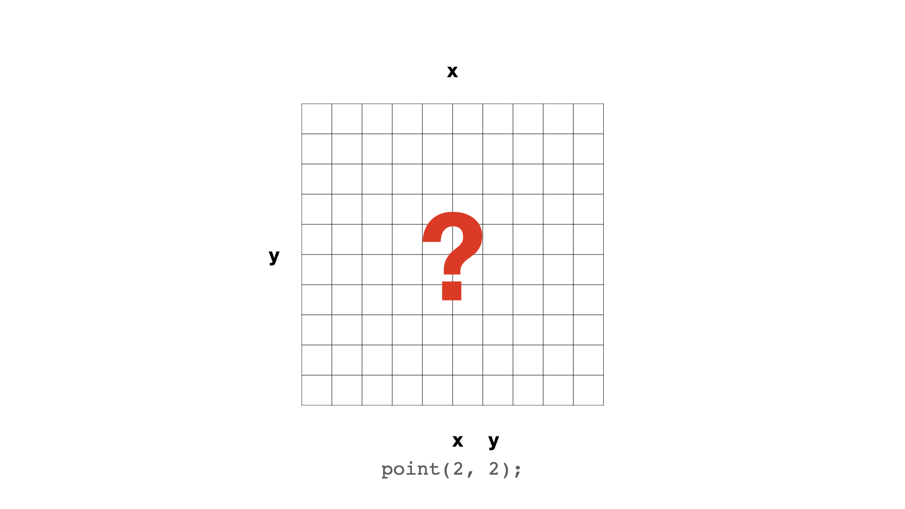

But what do those numbers actually *mean*?

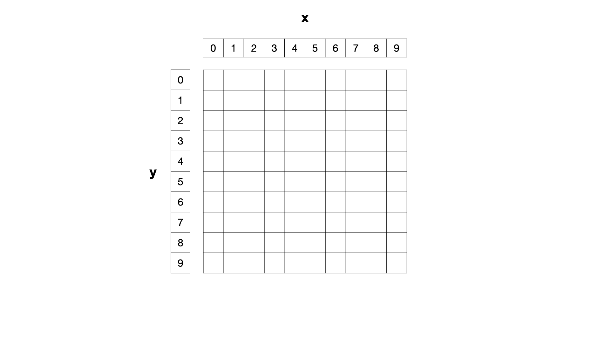

Well, the pixels on the canvas are actually numbered like *this*. 

The *x* coordinates start from the left at `0` (*not 1*) and go up as you move to the right. So the 10th pixel from the left is labelled as `9`.

The *y* coordinates start from the top at `0` (*not 1*) and go up as you move downward on the *y* axis. So the 10th pixel from the top is labelled as `9`.

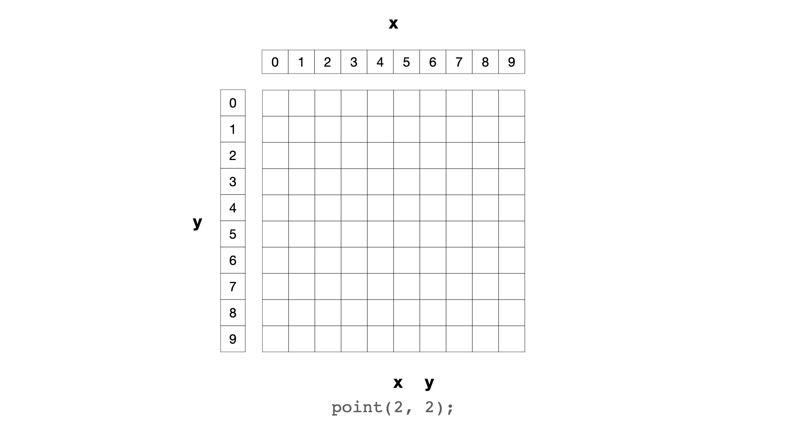

So, when we tell our program to draw a point (pixel) at coordinates (2, 2) we're using that *coordinate system*.

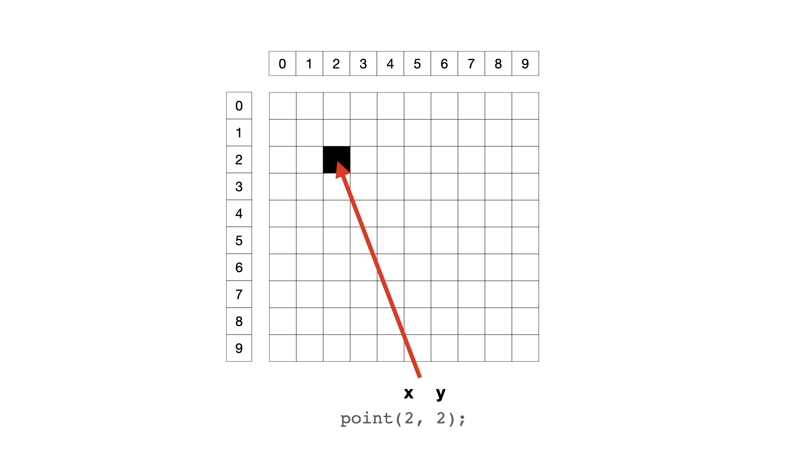

And thus the pixel lands here.

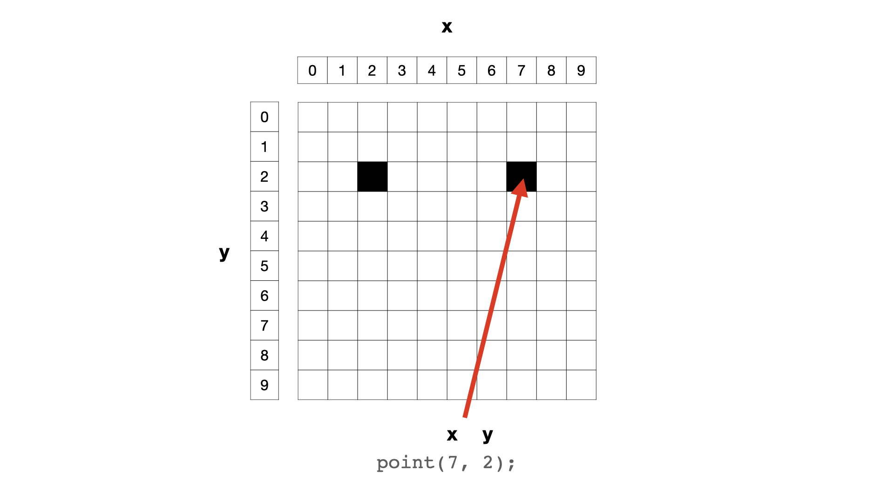

A pixel positioned at (7, 2) lands here.

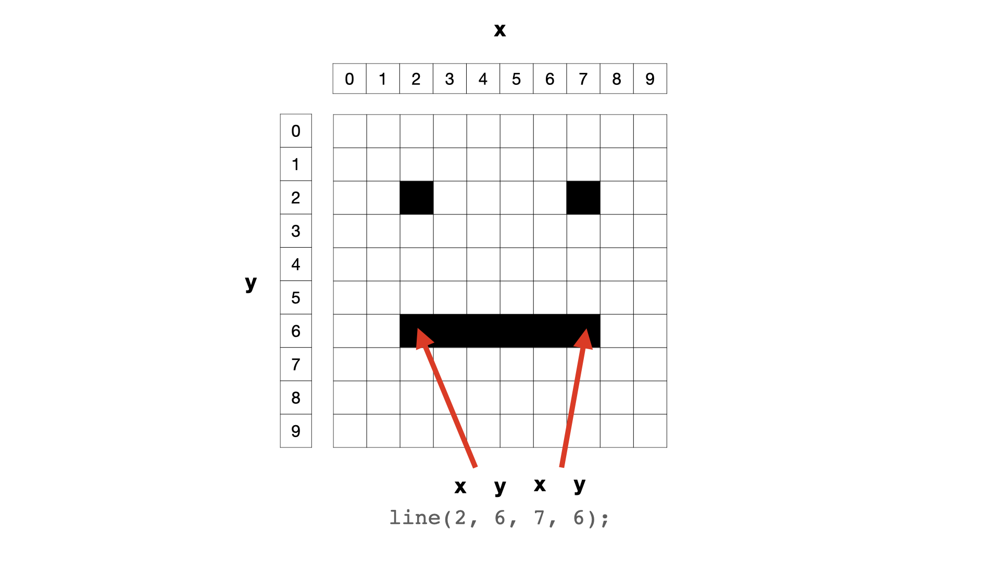

And a line from coordinates (2, 6) to coordinates (7, 6) will be drawn like this.

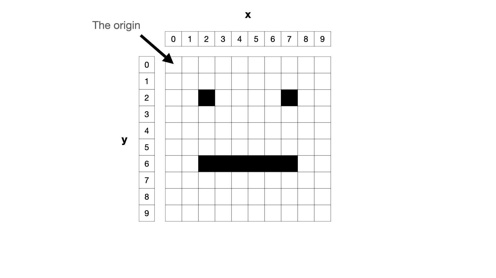

And that's about it. Except that you should know that position (0, 0) is usually known as *the origin*.

Things are always being drawn *relative to the origin*.

## Draw a rectangle

Let's draw a square on the canvas so we can experience the majesty of one last *function call* with different arguments. Since we're going to be drawing now, we'll add it to `draw()` like this:

```javascript
function draw() {
 background(255, 100, 100);
 rect(200, 80, 240, 320);
}
```

This is using the p5 function `rect()` to draw a rectangle in the centre of the canvas. Once again the *function name* and the *arguments* are different, but the basic shape of the *function call* is the same. It always is.

(**Question:** Why is it `rect` and not `rectangle`? Good question. Programmers often like "saving space" even though it's almost always a bad idea for legibility. Sigh.)

So, what are the numbers this time? You can probably guess, but:

1. The `200` is the x-coordinate of the rectangle's *top-left corner*
2. The `80` is the y-coordinate of the rectangle's *top-left corner*
3. The `240` is the *width* of the rectangle in pixels
4. The `320` is the *height* of the rectangle in pixels

If you check back in your browser you *should* see that the webpage has updated since last time (it's Go *Live* remember) and you *should* see the rectangle.

## Meaning

It does *not take much* for a program to mean something.

What if I told you that this is a program that simulates the experience of a writer staring at a blank piece of paper as they try to start writing their new novel. Well it does! And can you type anything? No! Oh the humanity!

## Play

Now would be a great time to play around the the numbers in the program. There are 10 of them and changing any of them will change the program. Can you make it *mean something else*?? Share your results!

## Summary

So we have done some real programming! In JavaScript! Using the p5 library!

Importantly, we have written *three function calls* that, together, draw a white rectangle with a black stroke on a pink background.

In doing so, we're coming to understand the anatomy of a *function call* in JavaScript. The way we can tell our program to do something complicated (create a canvas, fill the background, draw a specific rectangle) only using a *function name* and some *arguments*. Power.

*And* we have given the program *meaning* despite its incredibly basic nature.

```javascript
function setup() {
 createCanvas(640, 480);
}

function draw() {
 background(255, 100, 100);
 rect(200, 80, 240, 320);
}
```

## Next

Our program has already become complex enough that we need a way to explain it. That way is called *commenting*.

## }
