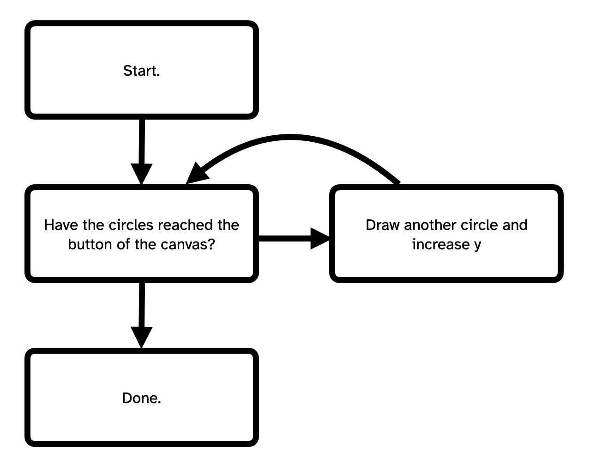

# Introducing `while`-loops {
    
Inspire!

## In this module

- Repetition
- The `while`-loop

## Repetition

As you're probably getting used to, one of the big motivations for new ideas in programming is about *avoid repetition* in our programming. Computers are good at repetition so we should really just let *them* handle it.

Consider drawing a series of circles on the canvas:

```javascript
function setup() {
    createCanvas(400, 400);
}

function draw() {
    background(0);
    
    // Set up the position and diameter of the first circle
    let x = width/2;
    let y = 0;
    let diameter = 50;
    
    // Draw it
    ellipse(x, y, diameter);
    // Move y down
    y += diameter;
    // Draw the next one
    ellipse(x, y, diameter);
    // And so on
    y += diameter;
    ellipse(x, y, diameter);
    y += diameter;
    ellipse(x, y, diameter);
    y += diameter;
    ellipse(x, y, diameter);
    y += diameter;
    ellipse(x, y, diameter);
    y += diameter;
    ellipse(x, y, diameter);
    y += diameter;
    ellipse(x, y, diameter);
    y += diameter;
    ellipse(x, y, diameter);
}
```

This *definitely works* but when we look at the code we should be very *suspicious* of how much repetition we've got going on there! We have the same two lines over and over again. We can do better.
    
## The `while`-loop

What we need is some code that will *repeat* until all the circles are drawn. Something that would follow this idea:


    
And luckily we can express *exactly* this idea with a while loop:

```javascript
while (condition) {
    // Repeat this
}
```

As you can see, we write:

- `while`: Tell JavaScript we're starting a `while`-loop
- `(condition)`: Just like an `if`-statement, we provide a condition for the loop. 
    - If it's `true` the loop executes its instructions in the curly brackets, then *checks again* if the condition is true
    - If it's `false` the loop doesn't do anything and the program moves on
    
### Drawing those circles

So, if we can come up with a *condition* that describes the repetition in our starting program, we can use a `while`-loop to handle this situation.

We basically want to *keep drawing circles* until `y` goes past the bottom of the canvas, which is to say is should keep drawing circles *if* `y <= height`:

```javascript
function setup() {
    createCanvas(400, 400);
}

function draw() {
    background(0);
    
    // Set up the position and diameter of the first circle
    let x = width/2;
    let y = 0;
    let diameter = 50;
    
    // Here is the magical while loop
    // Keep checking if y is still less than the height...
    while (y <= height) {
        // If it is, draw the next circle
        ellipse(x, y, diameter);
        // And increase y to move down
        y += diameter;
    }
}
```

Same outcome! Way less code! Try changing `diameter` to 10. Whoa, that is 40 circles my friend! The `while`-loop doesn't care how many times it needs to run, it just runs.

## Summary

...
    
## }