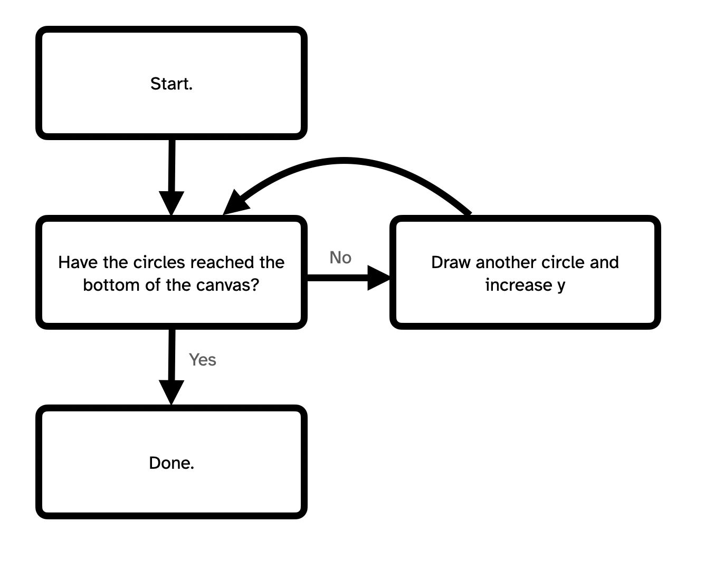

# Introducing `while`-loops {
    
One of true the joys of programming is when we realize that we can get the computer to do something super repetitive for us! Loops are at the heart of this idea, and `while` loops are the loopiest loops of all!

## In this module

- Preparation
- Repetition
- Seeing the repetition clearly
- The `while`-loop

## Preparation

1. Download the [Vertical Circles Project](./examples/vertical-circles.zip)
2. Unzip it
3. Move the folder into your repository
4. Open it in VS Code
5. Commit and push the changes

## Repetition

As you're probably getting used to, one of the big motivations for new ideas in programming is about *avoid repetition* in our programming. Computers are good at repetition so we should really just let *them* handle it.

Consider our starting project that draws a series of circles from the top to the bottom of the canvas. We should be able to look both at the *result* (a string of evenly spaced circles) and the *code* (a heck of a lot of very similar `ellipse()` instructions) and feel *suspicious* about how repetitive it looks.

It *works*, but there *must be a better way* right? What's the point of computers if they can't do this stuff for us?

## Seeing the repetition clearly

One way we can really focus in on the nature of the repetion here is to use variables instead of hard-coded numbers. Specifically, our draw could be changed as follows by using variables for the `x`, `y`, and `diameter` of our circles...:

```javascript
function draw() {
    background(0);

    // Set up the position and diameter of the first circle
    let x = width / 2;
    let y = 0;
    let diameter = 50;

    // Draw it
    ellipse(x, y, diameter);
    // Move y down to draw the next circle below it
    y += diameter;
    // Draw the next circle
    ellipse(x, y, diameter);
    // Move y down again...
    y += diameter;
    ellipse(x, y, diameter);
    y += diameter;
    ellipse(x, y, diameter);
    y += diameter;
    ellipse(x, y, diameter);
    y += diameter;
    ellipse(x, y, diameter);
    y += diameter;
    ellipse(x, y, diameter);
    y += diameter;
    ellipse(x, y, diameter);
    y += diameter;
    ellipse(x, y, diameter);
}
```

In switching to variables we've actually made this program *longer*! But we've also revealed the ugly truth of its repetition and put it into a form where we can intervene!
    
## The `while`-loop

What we need is some code that will *repeat* those two key instructions we're seeing repeated until all the circles are drawn. Something that would follow this idea:


    
And luckily we can express *exactly* this idea with a while loop:

```javascript
while (condition) {
    // Repeat this
}
```

As you can see, we write:

- `while`: Tell JavaScript we're starting a `while`-loop
- `(condition)`: Just like an `if`-statement, we provide a condition for the loop. 
    - If it's `true` the loop executes its instructions in the curly brackets, then *checks again* if the condition is true
    - If it's `false` the loop doesn't do anything and the program moves on
    
### Drawing those circles

So, if we can come up with a *condition* that describes the repetition in our starting program, we can use a `while`-loop to handle this situation.

We basically want to *keep drawing circles* until `y` goes past the bottom of the canvas, which is to say is should keep drawing circles *while* `y <= height`:

```javascript
function setup() {
    createCanvas(400, 400);
}

function draw() {
    background(0);
    
    // Set up the position and diameter of the first circle
    let x = width/2;
    let y = 0;
    let diameter = 50;
    
    // Here is the magical while loop
    // Keep checking if y is still less than the height...
    while (y <= height) {
        // If it is, draw the next circle
        ellipse(x, y, diameter);
        // And increase y to move down
        y += diameter;
    }
}
```

Same outcome! Way less code! No written-out repetition!

Try changing `diameter` to 10. Whoa, that is 40 circles now! This is key as well, using these higher level structures like `while` loops gives us a huge amount more flexibility in our programming. It's more like we're "describing what to do" than explicitly listing every step, and that's powerful.

## Summary

Whenever we notice that our program does something clearly repetitive we should always ask ourselves whether we can accomplish the same idea using a loop. A `while` loop is an easy place to start because it has the simplest expression: keep doing the *action* for as long as the *condition* stays true.
    
## }