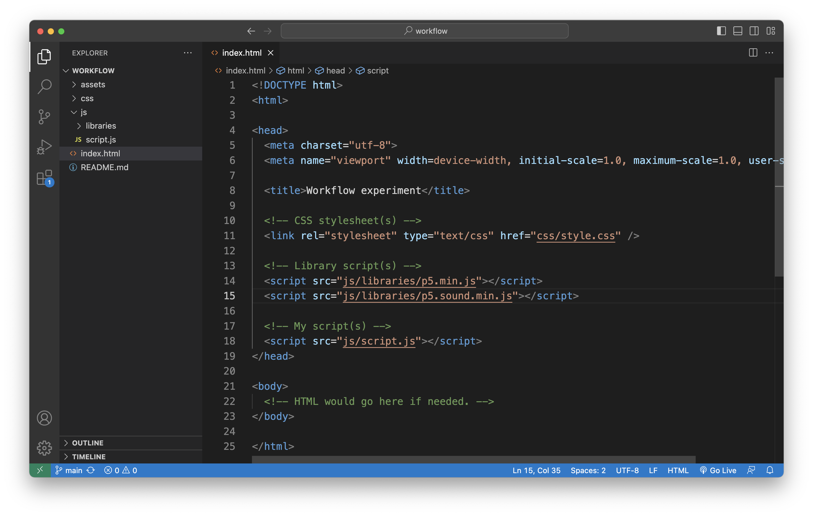
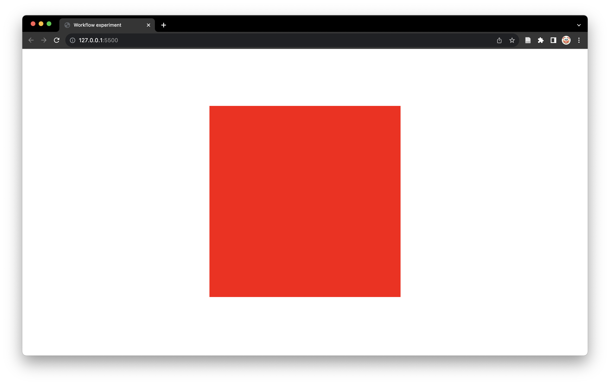
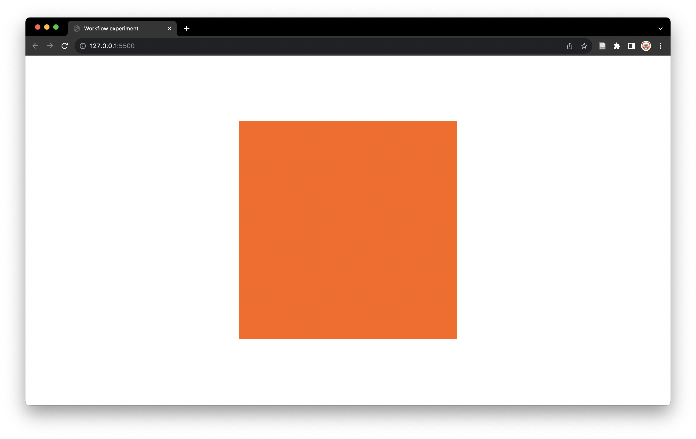

# Version control and workflow {

## In this module

- Why use version control? And what is it?
- Always work in the repository folder
- Starting a new project with the template
- The coding workflow
  - making changes
  - checking them in "Go Live" mode
  - committing them to the repository
  - and pushing them to GitHub
- Viewing your work online using GitHub Pages

---

## Why use version control?

In this course we will be using "version control". We'll achieve this via our `cart253-2023` **Git repository** to store all our coursework. So what is version control? What is Git? What is a repository? What is GitHub Desktop for? How do we actually use all this stuff? And why should we?

For many tasks, just having a file that you edit and save repeatedly over time is completely fine. Maybe it's an essay for a course, maybe it's a list of all your games, maybe it's something else.

But most of us have had a situation in which we want to keep a series of **versions** of a file. Mostly it's because if we screw up, we can more easily go back to a version that was still good. Maybe we're working on a complicated image in PhotoShop and we end up with a series of files called `cool-pic-1.psd`, `cool-pic-2.psd`, `cool-pic-2b.psd`, `cool-pic-3.psd`, and so on. The set of files end up as a kind of **history** of the final file.

With **programming**, this idea of keeping track of the history of a coding project over time is very, very important. It's called **version control**. In part, it's important because it's good to be able to **undo** things by going back in history. But it's also important because it's good to be able to **see** that history to understand the project. It's especially useful if you're working with other people.

Git and other version control software is so popular and so important in the programming world that it is **essential** that you understand how it works and how to use it. It will be part of getting a job later, as well as making your life better forever.

---

## What is Git? A repository? GitHub Desktop?

**Git** is software that helps to automatically keep track of the history of versions of our files. For any project, we create a **Git repository** (often called a "repo") which is like a folder that tracks the history of everything that happens in it. We will use **GitHub Desktop** to manage our repository easily.

In order to use **Git** we need to change the way we work a little bit. As well as having our set of files for a project (like the HTML, CSS, JavaScript, images, etc.) and saving them each time we make changes, we need to add an extra layer.

### Use the repository folder

It all begins with the **repository folder** you created in the last module, probably called something like `cart253-2023`. It exists as a folder on your computer and the most important thing to remember up top is: **do all your work inside this folder**. That will unlock the potential of version control.

In order to see what that looks like, as well as to get a first understanding of VS Code as our coding environment, let's setup a new little project and follow the steps of editing and changing it within version control.

---

## Starting a new project

### Use the template

When we start a new project, the easiest thing is generally to begin with the [template p5 project](../../templates/template-p5-project.zip) provided on the course website. This folder provides you with all the pieces you need to write a JavaScript program that will run on a webpage.

In order to be good citizens of the version control society, we should get our template project folder, name it something sensible, and then store it inside our repository. **That's just how we start projects**, so:

1. [Download the template](../../templates/template-p5-project.zip)
1. Unzip it
1. Rename the **folder** you get to something sensible like `workflow` (because this will be a project about exploring out workflow)
1. Copy the folder into your `cart253-2023` repository folder on your computer. For bonus points, consider investing in some structure by first creating an `experiments` folder that you can store `workflow` in so that things stay organized.

That basic process of grabbing the template, renaming the folder, and storing it somewhere sensible in your repository is where each new project will begin, big or small.

### Ch-ch-changes

Because we have now *changed* something inside the respository (by adding files), if we open GitHub Desktop we will see that it has *noticed the changes* and lists them. All the new files have little green + signs next to them to show they're new. To follow along:

1. Open GitHub Desktop (log in if you need to)
1. If you only have your `cart253-2023` repository it should show by default. (If it isn't selected, click the button at the top right where it says "Current Repository" and select your `cart253-2023` repository from the list.)
1. Notice that next to the "Changes" tab (on the left) there is now a number, indicating that files have been changed in the repository. Below, you can see all the files that have been changed (in this case by being added).

### Time to commit

We want to *commit* our work every time we make any significant step in a project, and simply *starting* is a significant step so let's do it now. A *commit* is when we want to actually *add the changes* to our repository. We're saying we want to commit to these changes because we're sure we want them in our project. Once we're done, this step in our project will be recorded in its history. Importantly, when we commit, we also write a **message** that describes our changes precisely. It's called a *commit message* and it shows up in the history.

Let's try this.

1. At the bottom left of the "Changes" tab there is a small interface to **commit** our changes.
1. There is a small "summary" field, and a longer field called "description".
1. In the small field, write a short message that explains the changes you made - *make sure it is descriptive*. In this case we could say something like "Started workflow experiment with the template project"
1. If you want to, write a longer description in the "description" field, go ahead.
1. Click the blue "Commit to main" button at the bottom!

The changes are committed along with your message! The new `workflow` project folder is now part of the repository on your computer and you will see there are now no changes displayed by GitHub Desktop.

### View the history

To prove to yourself that the changes and the message are really there in GitHub Desktop, go to the "History" tab next to the "Changes" tab. You will see a list of the **commit history** of your `cart253-2023` repository. Right now it is probably small, but it will get very long. The most recent commit is at the top, and it should have the message you just wrote.

If you select the commit in the history, you can also see a list of the files that were changed (or in this case added) and the changes that were made to them.

### Push the changes

Currently the repository on your computer is up to date with the `workflow` project folder, but the version of your repository that lives on GitHub.com is not (go check if you want to). We always want these two versions of the repository to be in sync to avoid trouble. To update the GitHub.com repository (called the **remote** repository) we need to **push** the changes we've made to it (it's just like **uploading** them).

1. In GitHub Desktop, notice the "Push origin" button in the top menu bar (it has a little "up arrow" beside it). The number beside it is the number of new commits made that must be uploaded or **pushed** to GitHub.com (you probably just have one)
1. Click the button.

After a hopefully short time, your changes (the commits) will have been uploaded to GitHub.com. This is great because they are safe there now ("in the cloud"). If you were to accidentally delete the `cart253-2023` folder (repository) on your computer, it would be fine because you could get all your files back from GitHub.com by cloning the repository again!

---

## Working in VS Code

### Atom

A quick reminder: when this course was originally developed we were using the *Atom* text editor. Because of this, the videos currently show Pippin using Atom to work on code and display it in the browser so you'll hear him talking about "Atom live server" a bunch. Now that we use *VS Code* we will see that this is just the same thing as using "Go Live". Other than this different, *Atom* and *VS Code* are incredibly similar.

### Open the `workflow` project folder in VS Code

When writing our code it is very, very important that we always open the **entire project** we are working on in VS Code. That is, we should always open the **main folder** that contains all the HTML, CSS, JavaScript, and other files that make up the project.

In this case, that is the `workflow` folder in our repository, so we should open that. There are a couple of ways.

- Drag the `workflow` folder onto the **VS Code** icon on your Dock or Task Bar
- In **VS Code** go to `File > Open...` and select the `workflow` folder, then choose "Open"

The key is that we want that specific folder open in its own window in VS Code. You'll be able to tell if you did it right because the lefthand sidebar will show the folder's name at the top, and then underneath will be all the files inside the folder.

**Note**: you **can** also open one of the files in the main folder like `index.html`, **but** this may lead to it opening in the wrong window or something else confusing. **Always** use the method above to open your project when you start work.

### Inside the template project (renamed to `workflow`)



- This is roughly what you should see when you open the project
- In this case we have the `index.html` file selected in the project on the left
- Most importantly, you can see the contents of the file you are editing in the main **editing window** (the biggest area)
- And you can see the file structure of the project in the left pane (the smaller, skinnier area with `index.html` selected)

To view any specific file, just select it in the lefthand sidebar.

### The template project structure

- Our standard template project has the following structure:

```
template-p5-project/
   css/
      style.css
   assets/
      images/
      sounds/
   js/
      libraries/
         p5.min.js
      script.js
   index.html
```

- At the top level we have `template-p5-project` - that's the folder that contains the total project, which we have sensibly renamed to `workflow` to reflect our current project
- Inside we have three folders called `css`, `assets`, and `js` (the forward slash is used to indicate a directory, but it isn't part of the name). These folders help to organise the files in our project.
- There's also a file at the top level called `index.html` which is the actual web-page that will be displayed when we run our project
- Inside `css` is `style.css` which controls the styling of the page - we won't worry much about this for a while
- Inside `assets` are two more folders, called `images` and `sounds`, which contain an example file in each, but we can imagine that we would put images and sounds in them!
- Inside `js` is a folder called `libraries` which contains the p5 library we're using in this course, the file for this is called `p5.min.js` - you can look at it, but it's pretty freaky
- Also inside `js` is our own script file called `script.js`

### `p5.min.js`

- In the `js/` folder is a folder called `libraries/` and in that folder is `p5.min.js`
- This file contains the **code for the p5 library**
- You can take a look at it, but it probably looks like nonsense
- Part of that is because of the `min` part of the name, it means **min**-ified which means it has been compressed and is not so readable anymore
- Notice that in `index.html`
  - there is a `<script>` tag that includes `p5.min.js` so that we can use it in our code in `script.js`
  - there is a `<script>` tag that includes `script.js` so that we can write our code in there and have it do things on the web page
- These two `<script>` tags are connecting the JavaScript to the HTML page being displayed

### Write some code

Just to see how running our code works in action, let's add a tiny bit of code to the `setup()` function in our `script.js` file so we can see something happen. Initially it will just look like this:

```javascript
/**
 * Description of setup()
*/
function setup() {

}
```

Let's add two lines of code so it looks like this:

```javascript
/**
 * Description of setup()
*/
function setup() {
    createCanvas(480, 480);
    background(255, 0, 0);
}
```

Don't worry about the specifics, we'll learn them later on! Just add those two lines, safe in the knowledge they are truly amazing.

### Run our code

Because we're using JavaScript, we will run our programs in a web browser. In this course we recommend either Chrome or FireFox.

While we could take the project and upload it to a web server, this would be time consuming if we had to do so every time we wanted to change our code and check how it works.

Instead, we'll use "Go Live" option in VS Code to immediately see our webpage and code running. So, at the bottom left of VS Code, click on the "Go Live" button and watch as it magically launches your browser and opens a new tab displaying your project!

### View the results in Chrome

VS Code will have run your browser by default and it should be displaying the results of our tiny program. If your default browser **is not** Chrome or FireFox, please change that for this course. It needs to be one of those two browsers for reasons we will cover later.

You should see something like the following:



That is, a red square in the centre of the webpage. That `background(255,0,0);` line made the red square appear there, and we'll learn more about all that soon enough. The code worked!

### VS Code is **live**

The beauty of VS Code's "Live mode" is that it will refresh our project in the browser whenever we make changes to our code (and save them), so we can easily check what the results of our work are.

Back in VS Code, change the numbers in the line

```javascript
background(255,0,0);
```

For example we could change them to

```javascript
background(255, 100, 10);
```

If we **save** then when we go back to our browser, we see... the red square is now an orange square! We changed its color with the power of numbers. And, importantly, just changing and saving the file automatically updated in the browser. Handy.



### Time to commit

Once again we have *changed* our workflow project, this time by *editing* a file inside it (`script.js`). Because we now use version control, if we think this is a significant step in our work we should **commit** our changes to the `cart253-2023` repository we are working in.

Let's pretend an orange square is deeply significant in the progress of our project and commit these changes in GitHub Desktop to get the practice.

1. Make sure you saved your `script.js` file
1. Go to GitHub Desktop and observe that once again it has *noticed* the changes made, this time with an orange - symbol showing that we edited a file
1. Write a message in the summary box describing the changes, something like "Created an orange canvas for workflow experiment"
1. Commit the changes by clicking on the "Commit to main" button
1. Push the changes by clicking on the "Push origin" button

We did it! We version controlled! We made key changes to our project (by creating an orange canvas), we committed those changes to our repository, and we pushed those changes to GitHub.com where they are nice and warm and safe.

### That's the workflow

This is our new working approach in this course. Instead of just "start project, edit, save, edit, save" as with ordinary software, we do "start project, commit, push, edit, commit, push, edit, commit, commit, push" to the cycle.

1. First we **edit** (or **add** or **remove**) one or more files in our project (like creating the `workflow` project or editing `script.js`)
1. Then we **save** the changes we made in VS Code
1. Then we **commit** the changes we made in GitHub Desktop (to add them to the local version of the repository)
1. Then we **push** the changes we made to GitHub.com (to save the in the remote version of the repository)

This will take some getting used to, but that's pretty much all there is to it.

Consider playing with the numbers in the two instructions we have in our `workflow` project a few times and commiting and pushing the results after checking them in the browser. What about changes like

```javascript
createCanvas(5000,10);
background(111,222,44);
```

or

```javascript
createCanvas(10, 200);
background(0, 0, 0);
```

Try it!

---

## Viewing your work online using GitHub Pages

In the previous module we made sure to activate "GitHub Pages" in the settings of our `cart253-2023` repository. Now we can reap the rewards!

GitHub Pages essentially allows us to treat any repository or any folder inside it as a website, so long as it has an `index.html` and so on. Well, our `workflow` project folder is a website, so let's view it online.

The process here is pretty simple, we just need to know the magical URL that lets us point a browser to our work. Pippin's version would look like this:

<https://pippinbarr.github.io/cart253-2023/experiments/workflow/>

The key for you to do the same is to use your username, your repository name, and your folders. The general version is:

<https://username.github.io/repository/path/to/folder/>

- `username` is your GitHub username (Pippin's is `pippinbarr`)
- `repository` is the name of your repository on GitHub (Pippin's is `cart253-2023`)
- `path/to/folder` is the sequence of folders in your repository that lead to the website folder (Pippin's is `experiments/workflow`)

Hey presto! You can now share your creations with the world!

---

## Summary

- We love and will always love version control using Git and GitHub.com
- We have a text-editor for our code (VS Code)
- We have a template project to start from (available in the `templates` folder of our course website)
- We always start new projects by putting the project folder inside our repository
- We have a JavaScript library to make visual programming easier (p5.js)
- We have a local server for testing our work (VS Code's "Go Live")
- We have a browser to view our work (Chrome or maybe Firefox)
- We have GitHub Pages to create actual webpages we can share with others

Make friends with and learn to love them all.

---

# }
