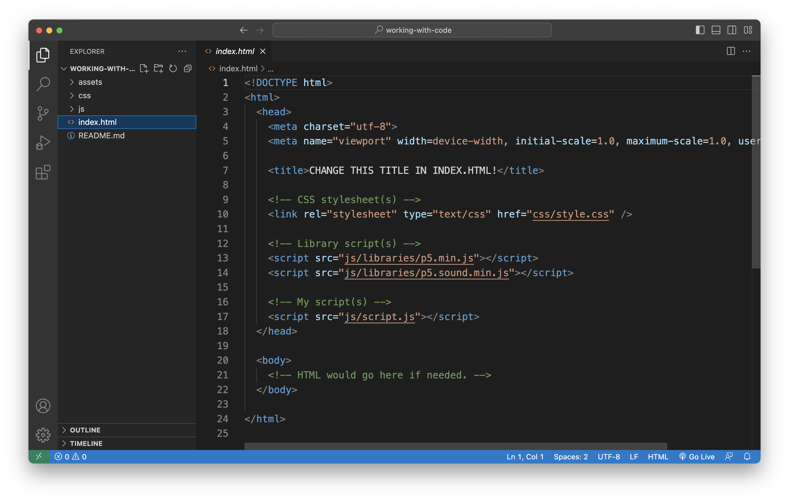
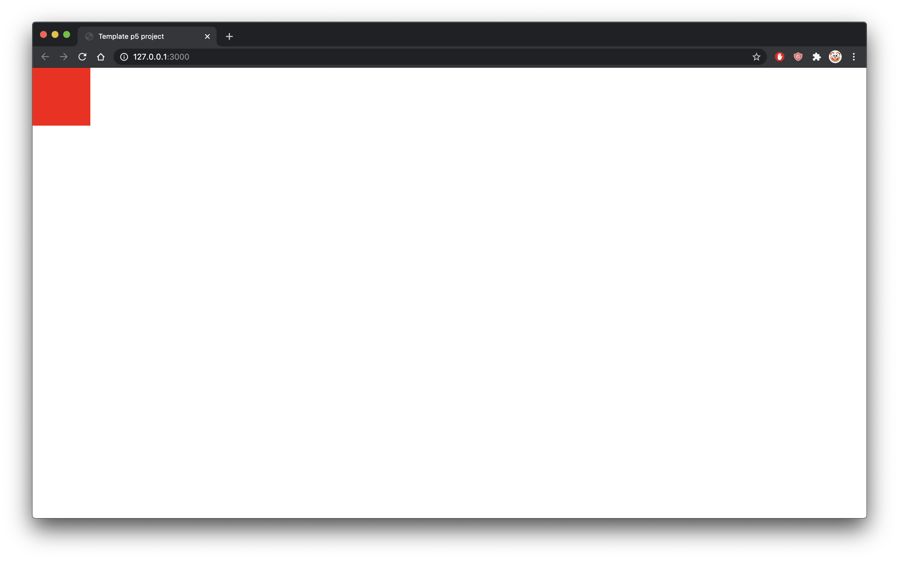

# Working with code in VS Code {

---

## In this module

- Running VS Code
- Opening the template project
- Adding some code
- Running code live in the browser with VS Code

---

## Running VS Code

**Launch VS Code** using whatever approach you prefer, such as:

- Find it in your Applications folder or in Program Files
- Click on it in the Dock or Task Bar at the bottom of your screen
- Use Command+Space (Mac) or "Windows Key"+S and type "VS Code"

You may see some default windows the very first time you open VS Code. None of them are useful to us in our work, so tell them not to appear by default if you want, and close them.

Create a new file using `File > New Text File` or using Command-X (macOS) or Control-X (Windows).

Type some words into the new file. That's called **text editing**!

**Programming is just fancy text editing with special words**.

**Note** that if last time you used VS Code you already had something open, it will probably open that project/file again. Close it if you don't want to work on that project/file, but it often turns out to be fairly convenient.

---

## The template project

When we write JavaScript in this class we will use a basic set of files and folders we will use every time to start a new project (any time we're writing new code). So follow the following steps to get the template project:

1. Download the [template project](../../templates/template-p5-project.zip)
2. Unzip it on your desktop or wherever you like (often it's enough to double-click the `.zip` file to unzip it)
3. You should now have a folder called `template-p5-project`

If you open the folder, you can see it has a bunch of files and folders in it. We want to open this template project in VS Code.

---

## Open the template project in VS Code

When writing our code it is very, very important that we always open the **entire project** we are working on in VS Code. That is, we should always open the **main folder** that contains all the HTML, CSS, JavaScript, and other files that make up the project.

In this case, that is the `template-p5-project` folder, so we should open that. There are a couple of ways.

- Drag the `template-p5-project` onto the **VS Code** icon on your Dock or Task Bar
- In **VS Code** go to `File > Open...` and select the `template-p5-project` folder, then choose "Open"

The key is that we want that specific folder open in its own window in VS Code. You'll be able to tell if you did it right because the lefthand sidebar will show the folder's name at the top, and then underneath will be all the files inside the folder.

**Note**: you **can** also open one of the files in the main folder like `index.html`, **but** this may lead to it opening in the wrong window or something else confusing. **Always** use the method above to open your project when you start work.

---

## Inside the template project



- This is roughly what you should see when you open the template project
- In this case we have the `index.html` file selected in the project on the left
- Most importantly, you can see the contents of the file you are editing in the main **editing window** (the biggest area)
- And you can see the file structure of the project in the left pane (the smaller, skinnier area with `index.html` selected)

To view any specific file, just select it in the lefthand sidebar.

---

## The template project structure

- Our standard template project has the following structure:

```
template-p5-project/
   css/
      style.css
   assets/
      images/
      sounds/
   js/
      libraries/
         p5.min.js
      script.js
   index.html
```

- At the top level we have `template-p5-project` - that's the folder that contains the total project
- Inside we have three folders called `css`, `assets`, and `js` (the forward slash is used to indicate a directory, but it isn't part of the name). These folders help to organise the files in our project.
- There's also a file at the top level called `index.html` which is the actual web-page that will be displayed when we run our project
- Inside `css` is `style.css` which controls the styling of the page - we won't worry much about this for a while
- Inside `assets` are two more folders, called `images` and `sounds`, which contain an example file in each, but we can imagine that we would put images and sounds in them!
- Inside `js` is a folder called `libraries` which contains the p5 library we're using in this course, the file for this is called `p5.min.js` - you can look at it, but it's pretty freaky
- Also inside `js` is our own script file called `script.js`

---

## `p5.min.js`

- In the `js/` folder is a folder called `libraries/` and in that folder is `p5.min.js`
- This file contains the **code for the p5 library**
- You can take a look at it, but it probably looks like nonsense
- Part of that is because of the `min` part of the name, it means **min**-ified which means it has been compressed and is not so readable anymore
- Notice that in `index.html`
  - there is a `<script>` tag that includes `p5.min.js` so that we can use it in our code in `script.js`
  - there is a `<script>` tag that includes `script.js` so that we can write our code in there and have it do things on the web page
- These two `<script>` tags are connecting the JavaScript to the HTML page being displayed

---

## Writing some code

Just to see how running our code works in action, let's add a tiny bit of code to the `script.js` file so we can see something happen. Initially it will just look like this:

```javascript
/**
 * Description of setup()
*/
function setup() {

}

/**
 * Description of draw()
*/
function draw() {

}
```

Let's add one line of code so it looks like this:

```javascript
/**
 * Description of setup()
*/
function setup() {
  background(255, 0, 0);
}

/**
 * Description of draw()
*/
function draw() {

}
```

Don't worry about the specifics, we'll learn them later on! Just add that one new line.

---

## Running our code

Because we're using JavaScript, we will run our programs in a web browser. In this course we recommend either Chrome or FireFox.

While we could take the project and upload it to a web server, this would be time consuming if we had to do so every time we wanted to change our code and check how it works.

Instead, we'll use "Go Live" option in VS Code to immediately see our webpage and code running. So, at the bottom left of VS Code, click on the "Go Live" button and watch as it magically launches your browser and opens a new tab displaying your project!

(Remember, if you don't see the "Go Live" button, you need to install the "Live Server" extension. See the [software](.software.md) page for details.

---

## View the results in Chrome

VS Code will have run your browser by default and it should be displaying the results of our tiny program. If your default browser **is not** Chrome or FireFox, please change that for this course. It needs to be one of those two browsers for reasons we will cover later.

You should see something like the following:



That is, a red square in the top left corner of the window. That `background(255,0,0);` line made the red square appear there, and we'll learn more about all that soon enough. The code worked!

---

## VS Code is **live**

The beauty of VS Code's "Live mode" is that it will refresh our project in the browser whenever we make changes to our code (and save them), so we can easily check what the results of our work are.

Back in VS Code, change the numbers in the line

```javascript
background(255,0,0);
```

For example we could change them to

```javascript
background(127,222,10);
```

If we **save** then when we go back to our browser, we see... the red square is now a green square! We changed its color with the power of numbers. And, importantly, just changing and saving the file automatically updated in the browser. Handy.

## Atom

A quick reminder: when this course was originally developed we were using the *Atom* text editor. Because of this, the videos currently show Pippin using Atom to work on code and display it in the browser so you'll here him talking about "Atom live server" a bunch. Now that we use *VS Code* we know that this is just the same thing as using "Go Live".

---

## Summary

- We have a text-editor for our code (VS Code)
- We have a template project to start from (available in the `templates` folder of our course website)
- We have a JavaScript library to make visual programming easier (p5.js)
- We have a local server for testing our work (VS Code's "Go Live")
- We have a browser to view our work (Chrome or maybe Firefox)

Make friends with and learn to love them all!

---

# }
